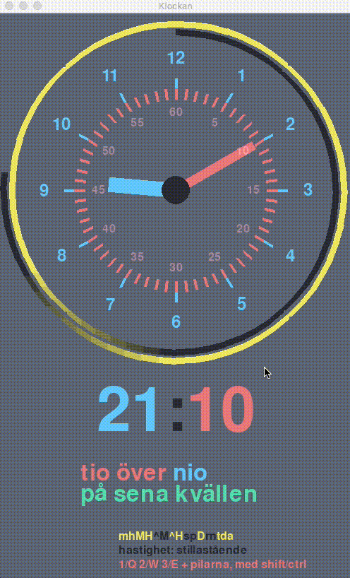

# Klockan

Klockan är ett program jag gjorde för att hjälpa min dotter lära sig klockan. Tyvärr hade hon inte tålamod till att kika på det mer än några minuter, men kanske någon annan har mer tur. 

De huvudsakliga funktionerna är

* Mycket konfigurerbar analog klocka (togglas med "a")
* Digital klocka (togglas med "d")
* En beskrivning av tiden som visas ("ung. fem i åtta på kvällen", togglas med "t")
* Pedagogiskt färgkodade tidsdelar

## Färgkodade tidsdelar
Tidsdelarna är färgkodade, gul för sekund, rött för minut och blått för timme.

* Sekundvisaren är därför gul, liksom sekund-delen av den digitala klockan. Sekund-visning (för både analog och digital klocka) togglas med "s"
* Minutvisaren är röd, liksom minut-delen av den digitala klockan och den minutrelaterade texten i beskrivningen. Minut-streck och minut-siffror (också röda) togglas med "Shift-M" och "m".
* Timvisaren är blå, liksom tim-delen av den digitala klockan och den timrelaterade texten i beskrivningen. Tim-streck och tim-siffror (också blå) togglas med "Shift-H" och "h".

# Andra aspekter
Med diverse andra snabbtangenter kan man ändra aspekter av vad som visas.

Om man vill att *minutvisaren inte ska stå stilla en hel minut*, och inte bara röra sig när sekundvisaren går från 59 till 00 kan man växla det beteendet med "Ctrl-M". Detta är vanligt förekommande på digitalt styrda analoga klockor.

Om man vill att *timvisaren ska stå stilla en hel timme*, och bara röra sig när minutvisaren går från 59 till 00 kan man växla det beteendet med "Ctrl-H". Detta är sällan förekommande i verkligheten eftersom tim och minutvisarna då överlappar för t.ex. "halv sju".

## Verklig tid och hastighet
Man kan få klockan att visa verklig tid med "n" (som i "nu"). Klockans rörelse kan dessutom slås på och av med "r", normalt går den i vanlig hastighet, men det kan ändras med ett antal tryck på pil upp eller ned, vilket också kan få klockan att gå bakåt. Slår man av och sedan på klockans rörelse (med "r") återställs hastigheten till normal hastighet.

## Ställa in viss tid
Vill man ställa in en viss tid kan man göra det med 1/Q för timvisaren, 2/W för minutvisaren och 3/E för sekundvisaren eller med pil höger/vänster (som styr sekundvisaren om den är synlig, och annars minutvisaren). Normalt flyttas visaren ett steg fram eller bak, men håller man dessutom in Shift och/eller Ctrl så rör sig visaren snabbare. Det finns inget sätt att hoppa direkt till en viss tidpunkt, förutom till aktuell tid (med "n").

## Dygns-illustration
En dygns-illustration visas som en spiral som går två varv runt den analoga klockan (eftersom ett varv är 12 timmar) vars färg grovt följer solens upp och nedgång (svart på natten som övergår i gul på dagen, och sedan tillbaka), Spiralen går från midnatt till timvisarens aktuella position, och kan togglas med "Shift-D".

## Pseudo-24-timmarsläge
Man kan också välja ett "pseudo-24-timmarsläge" för den analoga klockan via "p" för att timmarna ska överensstämma bättre med den digitala klockan som alltid visar 24-timmarsläge. I detta läge ändras tim-siffrorna (men allt annat ser normalt ut) till att visa 12 timmar från en 24-timmarsklocka istället (ca sex timmar bakom och framför timvisaren).

Klockan ett på eftermiddagen visas då som 13 (omgivet av 11, 12, 13, 14 och 15), medan klockan ett på natten visas som 01 (omgivet av 23, 00, 01, 02 och 03) - en gul markör mitt emot timvisaren visar var gränsen mellan "framtid" och "förfluten tid" går. Står timvisaren på klockan 01, kommer då kl 07 följas av ett gult streck och kl 20 på urtavlan, men om timvisaren står på klockan 13, kommer kl 19 följas av ett gult streck och kl 08.

